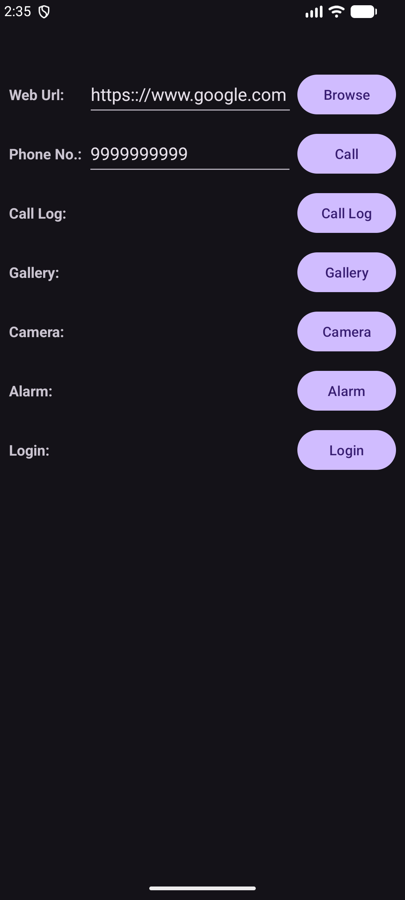
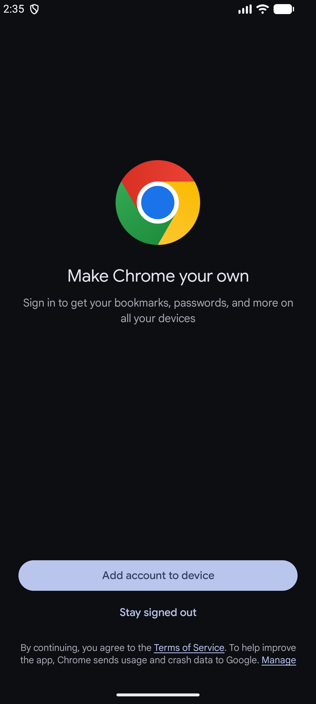
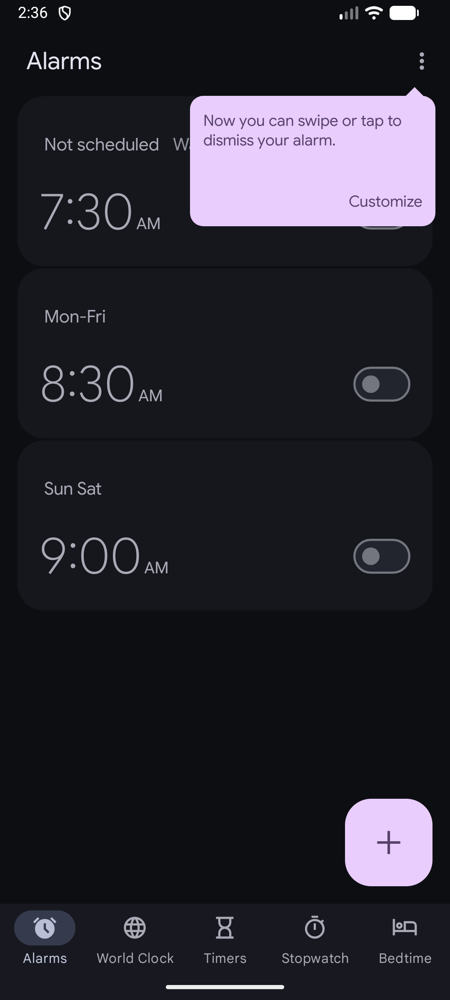
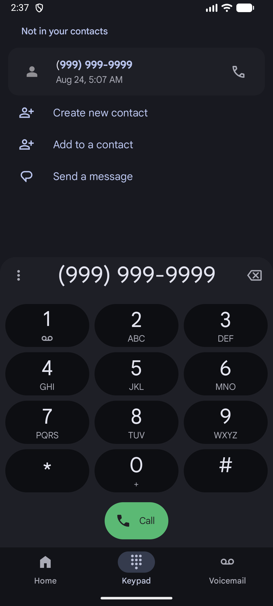

# 24012011128 MAD Practical 3

An Android application developed using Kotlin and Android Studio to demonstrate Android activities, UI layouts, and implicit intent handling.

## Features

- **Web Browser Intent** — Opens a user-provided web URL using `Intent.ACTION_VIEW`.
- **Phone Dialer Intent** — Opens the phone dialer with the entered phone number using `Intent.ACTION_DIAL`.
- **Camera Intent** — Launches the device camera using `MediaStore.ACTION_IMAGE_CAPTURE`.
- **Alarm Intent** — Opens the device's alarm interface using `AlarmClock.ACTION_SHOW_ALARMS`.
- **Login Screen UI** — Includes a separate login activity with email and password fields.
- **Material UI Components** — Uses AndroidX, ConstraintLayout, and Material components.

## Technologies Used

- Kotlin
- Android Studio
- Android SDK
- AndroidX
- ConstraintLayout
- Material Components
- Gradle

## Project Structure

```text
24012011128_MAD_PRAC3/
├── app/
│   └── src/
│       └── main/
│           ├── java/
│           │   └── com/example/a24012011128_mad_prac_3/
│           │       ├── MainActivity.kt
│           │       └── LoginActivity.kt
│           ├── res/
│           │   ├── layout/
│           │   │   ├── activity_main.xml
│           │   │   └── activity_login.xml
│           │   └── values/
│           │       ├── colors.xml
│           │       ├── strings.xml
│           │       └── themes.xml
│           └── AndroidManifest.xml
└── README.md
```

## Requirements

- Android Studio
- Android SDK with API level 37
- JDK 11
- Android device or emulator running Android API 24 or higher

## How to Run

1. Clone or download the repository.
2. Open the project in Android Studio.
3. Allow Gradle to sync and download the required dependencies.
4. Connect an Android device or start an emulator.
5. Click **Run** in Android Studio.
6. Use the available buttons to test the different intents.

#Screenshots

|  |  |  |
| :---: | :---: | :---: |
|  |  |  |

|  |  |  |
| :---: | :---: | :---: |
|  |  |

---

## Application Details

**Application ID:** `com.example.a24012011128_mad_prac_3`

**Minimum SDK:** 24

**Target SDK:** 37

**Version:** 1.0
